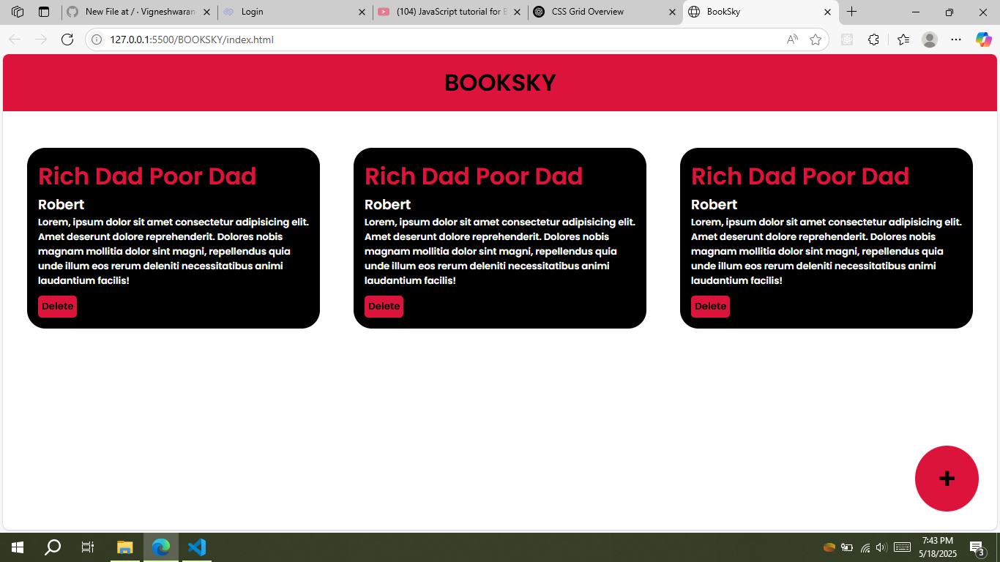

# 📚 BookSky

**BookSky** is a dynamic web-based application designed to manage a personal library of books. It allows users to add, view, and remove book entries through an interactive and responsive interface.

## ✨ Features

- Add books with title, author, and description
- Responsive grid layout for displaying book cards
- Modal popup form for adding new entries
- Option to delete individual book entries dynamically

## 🛠️ Technologies Used

- HTML5
- CSS3 (Responsive Grid Layout, Flexbox)
- JavaScript (DOM Manipulation, Event Handling)

## 📸 Screenshot



## 🚀 Getting Started

1. Clone the repository:
   ```bash
   git clone https://github.com/your-username/booksky.git
2.Open the index.html file in your browser to run the app locally.

📂 Project Structure
   booksky/├── index.html
           ├── style.css
           ├── script.js
           └── README.md
📌 Future Enhancements

   1.Store book entries in localStorage
   2.Add edit functionality
   3.Add category filters or search bar
